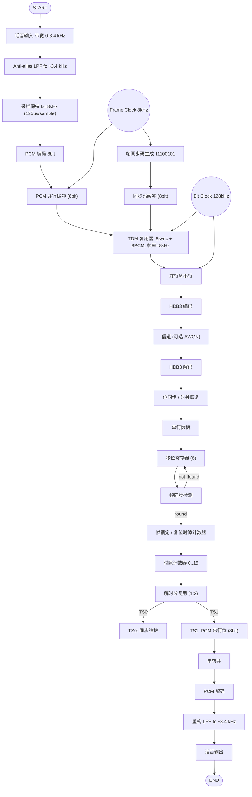
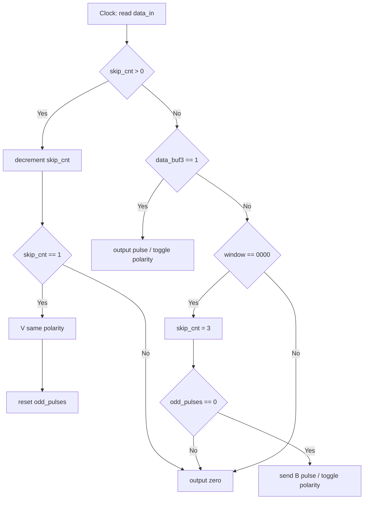
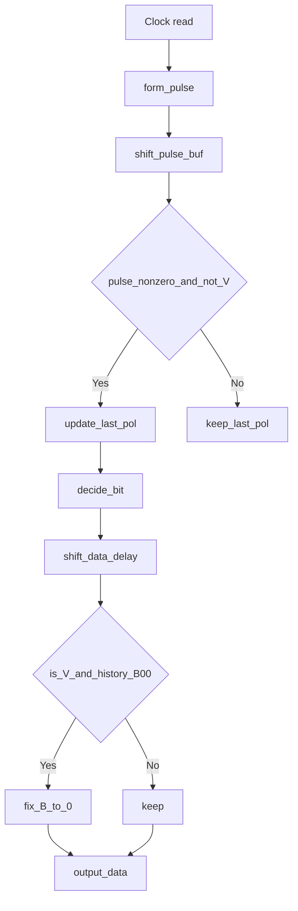

## Todo：

1. 帧同步码和模拟话音信号为输入信号
2. 两路时分复用
3. 模拟话音信号采用 PCM 编译码
4. 信道传输采用 HDB3 编译码
5. 不要忘了需要解时分复用、与话音信号的 PCM 译码

---

## Question：

1. 这个系统的时序逻辑是怎样的
2. 我是否可以使用 simulink 实现
3. 关于各路信号的采样速率，以及传输速率
4. 我应该如何在 simulink 中设置正确的参数
5. 我需要设计一个外部时钟源吗
6. 关于时分复用在 simulink 中实现的具体操作
7. 解时分复用又该如何实现
8. 关于帧同步码和位同步的关系
9. 位同步我可以理解为一个外部时钟源吗
10. 帧同步码应该如何检测

---

## Reference：

![[Pasted image 20251221161540.png]]

_图：两路时分复用系统的端到端模块划分示意（发送端/信道/接收端）_

```
发送端 (Transmitter):
├── 音频信号源
│   ├── Sine Wave (测试信号) 或 Audio File Read
│   ├── Anti-aliasing LPF (fc=3.4kHz)
│   └── Zero-Order Hold (采样率 Fs_audio)
│
├── PCM编码路径
│   ├── Quantizer (8-bit均匀量化)
│   ├── Integer to Bit Converter
│   └── Buffer (存储8位PCM码)
│
├── 帧同步路径
│   └── Constant (11100101) → Buffer
│
├── 时分复用器
│   ├── Frame Counter (模2计数器)
│   ├── Multiplexer (2:1选择器)
│   └── Parallel to Serial Converter
│
└── HDB3编码
    └── MATLAB Function (HDB3编码算法)

信道 (Channel):
└── AWGN Channel (可选)

接收端 (Receiver):
├── HDB3译码
│   └── MATLAB Function (HDB3译码算法)
│
├── 位同步模块
│   ├── Early-Late Gate或PLL
│   └── Clock Recovery
│
├── 帧同步检测
│   ├── Shift Register (8位)
│   ├── Correlator (与同步码相关)
│   └── Frame Sync Detector
│
├── 解时分复用
│   ├── Slot Counter (模2计数器)
│   ├── Demultiplexer (1:2分配器)
│   └── Buffer to PCM
│
└── PCM解码路径
    ├── Bit to Integer Converter
    ├── PCM Decoder (查表法)
    └── Reconstruction LPF (fc=3.4kHz)
```

---

## Flowchart：



---

## debug

1. 先搭建 PCM 编码解码链路（单独测试）
2. 添加帧同步码生成和检测
3. 实现时分复用和解复用
4. 添加 HDB3 编码解码
5. 集成位同步模块
6. 整体调试

### PCM 编译码
```mermaid
flowchart TD
    subgraph Transmitter [发送端 (编码过程)]
        A[模拟话音信号输入] --> B[抗混叠滤波<br>(Anti-aliasing Filtering)]
        B --> C[8 kHz 采样保持<br>(Sampling & Hold at 8 kHz)]
        C --> D[量化<br>(Quantization)]
        D --> E[8 bit 编码<br>(8-bit Encoding)]
        E --> F[二进制码流输出<br>(Binary Bit Stream)]
    end

    subgraph Channel [传输通道]
        F --> G[传输]
    end

    subgraph Receiver [接收端 (译码过程)]
        G --> H[码字映射回量化电平<br>(Mapping Codewords to Quantization Levels)]
        H --> I[重构低通滤波<br>(Reconstruction Low-pass Filtering)]
        I --> J[恢复话音波形输出<br>(Restored Analog Voice Signal)]
    end

    Transmitter --> Channel
    Channel --> Receiver

    style Transmitter fill:#e0f2fe,stroke:#0369a1
    style Receiver fill:#fefce8,stroke:#a16207
    style Channel fill:#f3f4f6,stroke:#4b5563
```
PCM 编码过程（模拟信号 → 数字码流）
PCM 编码分**抽样、量化、编码**三步，最终把连续模拟信号转换成二进制数字码流：

1. 抽样：把连续信号 “离散化”

    - **原理**：依据**奈奎斯特抽样定理**—— 只要抽样频率 ≥2 倍的信号最高频率，就能通过抽样值完全恢复原始模拟信号。
    - **操作**：用一个**周期性的抽样脉冲（比如你框图里的`rect_wave`）**，去 “截取” 连续的模拟信号（如话音），得到**离散的抽样值序列**（信号幅度还是连续的，只是时间上离散）。
    - 举例：话音信号最高频率约 4kHz，所以抽样频率通常选 8kHz（刚好是 2×4kHz），对应每 125μs 抽 1 个样。

2. 量化：把连续幅度 “阶梯化”
   抽样得到的 “离散值” 幅度还是连续的（比如可能是 0.23V、0.24V…），量化是把这些连续幅度**映射到有限个 “离散电平”**（相当于 “取整”）。

    - **均匀量化**：把信号幅度范围平均分成 N 个区间，每个区间对应一个量化电平（比如把 ±1V 分成 256 个区间，每个区间对应一个 8 位二进制数）。
    - **非均匀量化（你用的 A-Law）**：小信号的量化区间更密、大信号的区间更疏（因为话音小信号占比高），通过 “压扩（压缩 + 扩展）” 改善小信号的量化信噪比 —— 你的`A-Law Compressor`模块就是做 “压缩量化” 的（把小信号放大后量化，大信号压缩后量化）。

3. 编码：把量化电平 “数字化”
   把每个 “量化电平” 对应成**二进制码**（比如 8 位 PCM 就是用 8 位二进制数表示一个量化电平），最终得到一串**二进制数字码流**。

    - 举例：8 位 PCM 会把 256 个量化电平对应成 00000000~11111111，你的`PCM_encode`模块就是完成这一步（输出的`PCM_encode.1~8`就是 8 位二进制码）。

---

PCM 解码过程（数字码流 → 模拟信号）
解码是编码的逆过程，分**解码、抽样重建**两步，最终把数字码流还原成连续模拟信号：

1. 解码：把数字码流 → 量化电平
   将接收到的二进制码流，反向映射回对应的**量化电平**（比如把 10010110 还原成对应的 0.35V 电平）—— 你的`PCM_decode`模块就是做这一步，输出的是离散的量化电平序列。

2. 抽样重建：把离散电平 → 连续模拟信号
   解码得到的是 “时间离散、幅度阶梯化” 的量化电平，需要通过**抽样保持 + 低通滤波**恢复成连续模拟信号，这就是 “抽样重建”：

### 时分复用

我来帮你设计一个**完全基于 Simulink 标准模块的时分复用模块**，不需要编写函数或 Verilog 代码。以下是详细的搭建方案：

#### 1. **系统总览**

```
两路时分复用：1路帧同步码 + 1路PCM信号
输出：串行数据流 (128 kbps)
```

#### 2. **所需主要模块**

```matlab
Simulink → Library Browser 中查找：
- Sources: Constant, Sine Wave, Pulse Generator
- Sinks: Scope, Display, To Workspace
- Signal Routing: Mux, Switch, Selector, Multiport Switch
- Discrete: Unit Delay, Zero-Order Hold
- Logic and Bit Operations: Logical Operator, Relational Operator, Bitwise Operator
- Communications Toolbox: Buffer, Unbuffer
```

#### 3. **时分复用模块详细搭建步骤**

##### **步骤 1：设置参数**

```matlab
% 在MATLAB工作区设置
Fs_audio = 8000;          % 音频采样率 8kHz
frame_sync = [1 1 1 0 0 1 0 1];  % 帧同步码
frame_period = 1/Fs_audio;       % 帧周期 125μs
bits_per_frame = 16;             % 每帧16位(8位同步 + 8位PCM)
bit_rate = Fs_audio * bits_per_frame;  % 128 kbps
bit_period = 1/bit_rate;         % 位周期 7.8125μs
```

##### **步骤 2：时钟系统**

```
使用模块：
1. Pulse Generator (帧时钟)
   - Period: 0.000125 (125μs)
   - Pulse Width: 50%
   - Phase Delay: 0
   - Sample time: -1 (继承)

2. Pulse Generator (位时钟)
   - Period: 7.8125e-6 (7.8125μs)
   - Pulse Width: 50%
   - Phase Delay: 0
   - Sample time: -1
```

##### **步骤 3：帧同步码生成器**

```
方法1：使用Constant + Repeating Sequence
  Constant模块:
    - Value: [1 1 1 0 0 1 0 1]
    - Sample time: 0.000125 (125μs)

方法2：使用Lookup Table (更灵活)
  Lookup Table模块:
    - Table data: [1 1 1 0 0 1 0 1]
    - Breakpoints 1: [0:7]
```

##### **步骤 4：PCM 信号源（假设已有）**

```
你的PCM编码模块输出应该连接到：
  Input Port → Buffer (8位并行) → [PCM数据寄存器]
```

##### **步骤 5：时隙计数器**

```
Counter Limited模块:
  - Upper limit: 15 (0-15计数)
  - Sample time: 7.8125e-6 (位时钟周期)
  - Count direction: Up
  - Reset: 帧时钟脉冲

或使用基本模块组合：
  Unit Delay → Sum → Switch (复位控制)
```

##### **步骤 6：数据选择器（时分复用核心）**

```
方案1：使用Multiport Switch (推荐)
  Multiport Switch模块:
    - Data Ports: 2
    - Inputs:
        端口1: 帧同步码位流
        端口2: PCM数据位流
    - Control Port: 时隙计数器值
    - Threshold: 7 (计数器<8选同步码，≥8选PCM数据)

方案2：使用Switch + Relational Operator
  Relational Operator模块:
    - Operator: <
    - 输入1: 时隙计数器值
    - 输入2: 8

  Switch模块:
    - Threshold: 0.5
    - 输入1: 帧同步码位
    - 输入2: PCM数据位
    - 控制: 比较器输出
```

##### **步骤 7：位流生成**

```
流程图：
时隙计数器(0-15) → 数据选择器 → 串行输出
                      ↑
    帧同步码位 ──────┘  │
    PCM数据位 ──────────┘
```

#### 4. **完整的 Simulink 模型搭建**

##### **模型结构：**

```
%% 顶层模型：TDM_Multiplexer.slx

输入端口:
  └── pcm_data_in (8位并行，125μs更新)

内部模块:
  ├── 时钟子系统
  │   ├── Pulse Generator (Frame_Clk, 8kHz)
  │   └── Pulse Generator (Bit_Clk, 128kHz)
  │
  ├── 帧同步码生成
  │   ├── Constant (同步码模式)
  │   ├── Counter (0-7循环)
  │   └── Selector (选择当前位)
  │
  ├── PCM数据接口
  │   ├── Buffer (将并行转缓冲)
  │   ├── Counter (位选择计数器)
  │   └── Selector (选择PCM当前位)
  │
  ├── 时隙控制
  │   ├── Counter (0-15)
  │   ├── Relational Operator (<8判断)
  │   └── Data Type Conversion
  │
  ├── 数据选择器
  │   └── Switch (2选1)
  │
  └── 输出接口
      └── 串行数据流
```

##### **详细连接步骤：**

**A. 时钟系统实现**

```
1. 添加两个Pulse Generator模块
   Frame_Clk: Period = 0.000125, Pulse Width = 1
   Bit_Clk: Period = 7.8125e-6, Pulse Width = 1

2. 添加两个Rate Transition模块
   将8kHz转换为128kHz时钟域
```

**B. 帧同步码位流生成器**

```
1. Constant模块:
   - Value: [1 1 1 0 0 1 0 1]'
   - Output data type: boolean

2. Counter模块:
   - Upper limit: 7
   - Sample time: 7.8125e-6
   - Reset port: Frame_Clk

3. Selector模块:
   - Index Mode: Index vector (port)
   - Input port size: 8
   - Index port: 计数器输出 + 1 (因为索引从1开始)
```

**C. PCM 数据位流生成器**

```
1. Buffer模块 (连接PCM输入):
   - Output buffer size: 8
   - Buffer overlap: 0
   - Initial condition: 0

2. Counter模块:
   - Upper limit: 7
   - Sample time: 7.8125e-6
   - Reset port: Frame_Clk (每帧重新开始)

3. Selector模块:
   - Index Mode: Index vector (port)
   - Input port size: 8
   - Index port: PCM位计数器 + 1
```

**D. 时隙控制系统**

```
1. Counter模块 (主时隙计数器):
   - Upper limit: 15
   - Sample time: 7.8125e-6
   - Reset port: Frame_Clk
   - Count direction: Up

2. Relational Operator模块:
   - Operator: <
   - 输入1: 时隙计数器值
   - 输入2: 8

3. Data Type Conversion模块:
   - Output data type: boolean
```

**E. 时分复用选择器**

```
Switch模块:
  - Criteria for passing first input: u2 > Threshold
  - Threshold: 0.5
  - 第一输入: 帧同步码位
  - 第二输入: PCM数据位
  - 控制输入: 比较器输出 (true: 选输入1, false: 选输入2)
```

#### 5. **替代方案：使用 MATLAB Function Block（简单代码）**

如果你愿意写几行简单代码，这个模块会更简洁：

```matlab
function serial_out = tdm_multiplexer(frame_sync, pcm_data, bit_counter, frame_clk)
% frame_sync: 8位同步码 [11100101]
% pcm_data: 8位PCM数据
% bit_counter: 0-15计数器
% frame_clk: 帧时钟脉冲

    persistent sync_reg pcm_reg;

    if isempty(sync_reg)
        sync_reg = [1 1 1 0 0 1 0 1];
        pcm_reg = zeros(1,8);
    end

    % 帧开始时更新数据
    if frame_clk
        pcm_reg = pcm_data;
    end

    % 根据计数器选择输出位
    if bit_counter < 8
        serial_out = sync_reg(bit_counter + 1);
    else
        serial_out = pcm_reg(bit_counter - 7);
    end
end
```

#### 6. **测试验证模块**

添加以下模块验证系统：

```
1. Scope模块 (观察信号):
   - 通道1: 帧时钟
   - 通道2: 位时钟
   - 通道3: 时隙计数器
   - 通道4: 复用输出

2. Display模块:
   - 显示计数器值
   - 显示当前输出位

3. To Workspace模块:
   - 保存输出数据到MATLAB工作区
```

#### 7. **时序图示例**

```
一个完整帧的时序 (16位):

时隙0-7: 帧同步码 (11100101)
时隙8-15: PCM数据 (xxxxxxxx)

时间: 0μs    125μs
      ├───────┬───────┤
      │ 帧1   │ 帧2   │

位时序: 每7.8125μs一个位
```

#### 8. **参数设置和调试技巧**

##### **关键参数检查：**

```matlab
1. 确保所有时钟同步
   - 位时钟频率 = 16 × 帧时钟频率

2. 数据更新时机
   - PCM数据在帧开始时更新
   - 计数器在帧开始时复位

3. 数据类型一致性
   - 所有逻辑信号使用boolean类型
   - 计数器使用uint8类型
```

##### **调试步骤：**

1. **先测试时钟系统**

    - 确保帧时钟 125μs 周期
    - 确保位时钟 7.8125μs 周期

2. **单独测试各子系统**

    - 帧同步码生成是否正确
    - PCM 接口是否正确缓冲

3. **测试时隙计数器**

    - 观察 0-15 循环
    - 验证帧时钟复位功能

4. **最终系统集成**
    - 验证输出数据格式
    - 检查时序关系

#### 9. **完整的 Simulink 模型示例**

```matlab
%% 使用以下模块构建模型：

% 1. 输入模块
In1 = Inport('PCM_Data_In');  % 8位并行输入

% 2. 时钟模块
Frame_Clk = PulseGenerator('Frame_Clock', 0.000125);
Bit_Clk = PulseGenerator('Bit_Clock', 7.8125e-6);

% 3. 帧同步码
Sync_Const = Constant('Sync_Pattern', [1 1 1 0 0 1 0 1]);

% 4. 计数器
Bit_Counter = Counter('Counter', 0, 15, 1, 'Up', 'on');
Sync_Bit_Counter = Counter('Sync_Bit_Cnt', 0, 7, 1, 'Up', 'on');
PCM_Bit_Counter = Counter('PCM_Bit_Cnt', 0, 7, 1, 'Up', 'on');

% 5. 选择器
Sync_Selector = Selector('Sync_Selector', 8);
PCM_Selector = Selector('PCM_Selector', 8);

% 6. 比较器
Compare = RelationalOperator('Compare', '<');

% 7. 复用器
Mux_Switch = Switch('TDM_Switch');

% 8. 输出
Out1 = Outport('Serial_Out');
Scope1 = Scope('Output_Scope');
```

#### 10. **常见问题解决**

1. **时序不同步**

    - 检查所有模块的采样时间设置
    - 使用 Rate Transition 模块处理不同速率信号

2. **计数器不工作**

    - 检查复位信号连接
    - 验证时钟信号是否正常

3. **选择器索引错误**

    - 确保索引从 1 开始（Simulink 默认）
    - 使用 Data Type Conversion 转换为整型

4. **输出数据格式错误**
    - 验证数据选择逻辑
    - 检查 Switch 模块的阈值设置

需要我为你绘制一个**具体的 Simulink 模块连接图**吗？或者你有哪个部分需要更详细的说明？

---

# HDB3 编码/译码 （verilog）

---

## 项目结构（文件与作用）

-   `sources_1/new/gen_data.v` - LFSR 伪随机数据发生器（用于简单随机测试）。

-   `sources_1/new/gen_data_fixed.v` - 固定测试序列（包含连续 0，用来触发 HDB3 替代规则）。推荐初学者先用这个。

-   `sources_1/new/hdb3_enc.v` - HDB3 编码器（把 1/0 变成双极性脉冲信号 hdb3_p/hdb3_n）。

-   `sources_1/new/hdb3_dec.v` - HDB3 译码器（从双极性脉冲还原 1/0，带修正机制）。

-   `sources_1/new/hdb3_top.v` - 顶层模块（把生成器、编码器、译码器连在一起）。

-   `sim_1/new/tb_hdb3.v` - 仿真测试平台（产时钟、复位，运行仿真）。

-   `constrs_1/new/hdb3.xdc` - 时钟约束文件（包含 50MHz 时钟约束，IO 引脚暂未绑定）。

---

## HDB3 原理（最简单的说法）

1. HDB3 是一种把二进制数据（1 和 0）转换成“正脉冲 / 负脉冲 / 无脉冲”（双极性）的方法。它的目标是：避免长时间同极性导致直流分量，并保证接收端可以恢复时钟。

2. 基本规则（用极其简单的话）：

-   每个数据 1 用一个脉冲表示，脉冲极性交替（+、-、+、-……）。

-   如果遇到 4 个连续的 0（`0000`），不能直接发送 4 个空位，会用特殊替代来打破直流：

-   若自上次 V（破坏脉冲）以来已发送的脉冲个数是偶数（parity = 偶），用 `B00V`：在第 3 位发送一个正常脉冲（B），第 4 位发送 V（V 的极性与上一个脉冲相同）。

-   若脉冲个数是奇数，用 `000V`：在第 4 位只发送一个 V（V 的极性与上一个脉冲相同）。

-   B 是“伪装成 1 的脉冲”，V 是“破坏脉冲”（用来修正直流）。

3. 两点记住：

-   `V` 与上一次有效脉冲同极性（故能改变串行极性平衡）；

-   接收端需要能识别 V，并把先前的 B（如果存在）修正回 0，从而恢复原始的 `0000`。

---

## 本项目如何实现 HDB3（逐步说明）

-   编码器（`hdb3_enc.v`）：

1. 用 4 位滑动窗口观察是否出现 `0000`。窗口最新移入位保存在 `data_buf`。

2. 跟踪上一次脉冲极性 `last_pulse_pol`（0 表示负，1 表示正）。

3. 用 `odd_pulses` 标志记录自上次 V 以来脉冲的奇偶性（0 偶数，1 奇数）。

4. 遇到 `0000`：

-   如果 `odd_pulses == 0`（偶数），输出 `B00V`（先输出 B，然后中间为 0，最后输出 V）。

-   若 `odd_pulses == 1`（奇数），输出 `000V`（前三位保持 0，第四位输出 V）。

5. 对于普通的 1：输出一个脉冲并翻转 `last_pulse_pol` 和 `odd_pulses`。

-   译码器（`hdb3_dec.v`）：

1. 读取两路信号 `hdb3_p`（正脉冲）、`hdb3_n`（负脉冲），把它们合成 2-bit `current_pulse`：`01`=正，`11`=负，`00`=空。

2. 维护一个 `pulse_buf` 的循环历史（最近 4 个周期），用于检测 `B00V` 模式（回溯检测）。

3. 通过比较当前脉冲极性与 `last_pulse_pol` 来判断当前脉冲是否为 V（如果相同则认为是 V）。

4. 当检测到 V 且历史为 `B,0,0` 时，把历史中的 B 修正为 0，从而把 `B00V` 恢复成 `0000`。

5. 输出的位会有一定延迟（因为译码器需要历史信息来做修正）。

---

## 如何在 Vivado 中仿真（最简单步骤）

1. 把所有源文件添加到 Vivado 工程（Design Sources / Simulation Sources）。

2. 打开 `tb_hdb3.v`，在仿真中运行 “Behavioral Simulation”。

3. 在波形窗口添加信号：`data_orig`, `hdb3_p`, `hdb3_n`, `data_decoded`。

4. 运行仿真（默认仿真时间足够观察），观察：

-   `data_orig` 为原始基带数据（`gen_data_fixed` 会循环输出固定序列）；

-   `hdb3_p`/`hdb3_n` 是编码器输出的双极性波形（注意 B 和 V 的位置）；

-   `data_decoded` 为译码后恢复的数据（与 `data_orig` 相同，但会延迟若干个时钟周期）。

> 小提示：若 `data_orig` 全 0，请检查 `hdb3_top.v` 中 `gen_data` 是否正确连接了 `clk` 和 `rst_n`（常见错误）。

---

## 常见问题与排查

-   仿真开机没数据：确认时钟 (`sys_clk`) 在 tb 里是否产生了并连接正确。

-   译码不一致：观察 `hdb3_p` / `hdb3_n` 是否如预期出现 B、V 波形；检查 `last_pulse_pol` 是否初始化一致。

---

## 后续改进建议（简单）

-   支持更多测试模式并自动检测译码错误率。

-   将模块做成参数化，支持不同长度的替代（研究用途）。

-   上板时在 `hdb3.xdc` 中配置真实 IO 引脚并测试实际硬件时延与抖动。

---

## 项目结构图（模块连接示意）

下面用一个简单的 ASCII 图展示模块间如何连接，便于理解信号流向：

```

+------------+    +-----------+    +-------------+    +-----------+

| gen_data_  | -> | hdb3_enc  | -> | hdb3_p/hdb3 | -> | hdb3_dec  |

| fixed/v    |    | (编码器)  |    | _n (编码输出)|    | (译码器)  |

+------------+    +-----------+    +-------------+    +-----------+

                         ^                                  |

                         |                                  v

                     (sys_clk)                         data_decoded

                         |

                      tb_hdb3

                    (时钟/复位)

```

-   说明：数据从 `gen_data_fixed`（或 `gen_data`）产生，送入 `hdb3_enc` 编码，编码结果由两路信号 `hdb3_p`（正）和 `hdb3_n`（负）输出；译码器 `hdb3_dec` 接收这两路输出并恢复 `data_decoded`。

---

## 滑动窗口示意与处理延迟（必看）

编码器使用一个 4 位滑动窗口来观察是否出现 `0000`，代码中用 `data_buf` 保存窗口内容，移位和处理方式如下：

-   新输入位 `data_in` 每个时钟沿移入 `data_buf[0]`。

-   随着每个时钟上升沿，`data_buf` 左移一位（`data_buf <= {data_buf[2:0], data_in}`），所以 `data_buf[3]` 是**本周期待处理的位**。

-   这意味着每个新输入位会在输入后的第 3 个时钟周期成为 `data_buf[3]` 被处理，也就是有 3 个周期的延迟。

示例（初始 `data_buf = 0000`，输入序列 `1 0 0 0 0`）：

| 周期 | 输入 `data_in`  | 移位后 `data_buf[3..0]` | 本周期处理的位 (`data_buf[3]`)  |
| ---- | --------------- | ----------------------- | ------------------------------- |
| T1   | 1               | 0 0 0 1                 | 0                               |
| T2   | 0               | 0 0 1 0                 | 0                               |
| T3   | 0               | 0 1 0 0                 | 0                               |
| T4   | 0               | 1 0 0 0                 | 1 (这是 T1 的输入)              |
| T5   | 0               | 0 0 0 0                 | 0                               |

注意：只有当 `data_buf` 的四个位（3..0）同时为 0 时，编码器才会触发 HDB3 的替代处理（B00V 或 000V）。

---

## 编码器流程图（mermaid）



---

## 译码器流程图（mermaid）



---

## 关键代码片段

-   在编码器（`hdb3_enc.v`）里，检测连续 4 个 0 并决定替代：

```verilog

// 如果窗口为 0000，开始替代处理

if (data_buf[3]==0 && data_buf[2]==0 && data_buf[1]==0 && data_buf[0]==0) begin

    skip_cnt <= 3; // 接下来 3 位由替代规则处理

    if (odd_pulses == 0) begin

        // 偶数脉冲 -> B00V：这里发送 B（会输出脉冲，切换极性）

    end else begin

        // 奇数脉冲 -> 000V：这里只在第 4 位输出 V（破坏脉冲）

    end

end

```

-   在译码器（`hdb3_dec.v`）里，发现 V 时回溯修正 B：

```verilog

// 若当前为 V，且历史为 B,0,0（pulse_buf[2] 有脉冲，pulse_buf[1],pulse_buf[0] 无脉冲）

if (is_v && pulse_buf[0]==0 && pulse_buf[1]==0 && pulse_buf[2]!=0) begin

    // 把历史上的 B 修正为 0，还原 0000

    data_buf[3] <= 0;

end

```

---

## 简单示例

假设编码器初始状态为 `last_pulse_pol = 0`（上次为负），`odd_pulses = 0`（自上次 V 以来脉冲数为偶数）。我们用短序列演示两种情形：

1. 示例 A：`1 0 0 0 0`

-   初始：last_pulse_pol=0, odd_pulses=0

-   T1 输入 `1`：输出脉冲 +（因为 last_pulse_pol=0 -> 本次为 +），更新 last_pulse_pol=1，odd_pulses 变为 1

-   接下来三位 0（T2-T4）：无输出

-   T5 为第 4 个连续 0，且 odd_pulses=1 -> 使用 `000V`，在 T5 输出 V（V 的极性与 last_pulse_pol 相同，即 +），并把 odd_pulses 设为 0

编码结果（脉冲序列）：

-   T1: +（来自数据 1）

-   T2: 0

-   T3: 0

-   T4: 0

-   T5: + （V）

译码器看到 `+` 在 T5 并结合历史，会判定为 V 并将之前的 B（如果存在）修正，从而恢复出 `1 0 0 0 0`（带延迟）。

2. 示例 B：假设在遇到 0000 时 `odd_pulses=0`（偶数），序列 `0 0 0 0` 会被编码成 `B 0 0 V`：

-   第 3 位发送 B（一个与规则相反的脉冲，用来平衡极性），第 4 位发送 V（与上一次脉冲同极性）。译码器会检测到 B00V 并把 B 修正为 0，恢复原始 `0000`。

---

## 在波形中如何快速识别 B 与 V

-   V：通常表现为与上一有效脉冲**同极性**的脉冲，且出现在连续 0 的末尾位置；

-   B：出现在连续 0 的中间且表现为普通的单个脉冲（会改变极性）。

---
