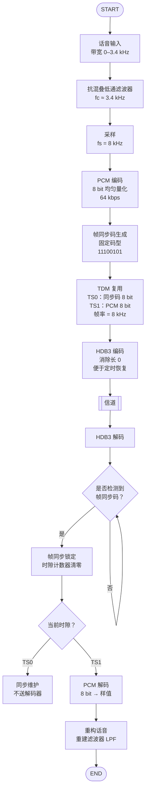

## Todo：
1. 帧同步码和模拟话音信号为输入信号
2. 两路时分复用
3. 模拟话音信号采用PCM编译码
4. 信道传输采用HDB3编译码
5. 不要忘了需要解时分复用、与话音信号的PCM译码

---

## Question：
1. 这个系统的时序逻辑是怎样的
2. 我是否可以使用simulink实现
3. 关于各路信号的采样速率，以及传输速率
4. 我应该如何在simulink中设置正确的参数
5. 我需要设计一个外部时钟源吗
6. 关于时分复用在simulink中实现的具体操作
7. 解时分复用又该如何实现
8. 关于帧同步码和位同步的关系
9. 位同步我可以理解为一个外部时钟源吗
10. 帧同步码应该如何检测

---

## Reference：
![[Pasted image 20251221161540.png]]

```
发送端 (Transmitter):
├── 音频信号源
│   ├── Sine Wave (测试信号) 或 Audio File Read
│   ├── Anti-aliasing LPF (fc=3.4kHz)
│   └── Zero-Order Hold (采样率 Fs_audio)
│
├── PCM编码路径
│   ├── Quantizer (8-bit均匀量化)
│   ├── Integer to Bit Converter
│   └── Buffer (存储8位PCM码)
│
├── 帧同步路径
│   └── Constant (11100101) → Buffer
│
├── 时分复用器
│   ├── Frame Counter (模2计数器)
│   ├── Multiplexer (2:1选择器)
│   └── Parallel to Serial Converter
│
└── HDB3编码
    └── MATLAB Function (HDB3编码算法)

信道 (Channel):
└── AWGN Channel (可选)

接收端 (Receiver):
├── HDB3译码
│   └── MATLAB Function (HDB3译码算法)
│
├── 位同步模块
│   ├── Early-Late Gate或PLL
│   └── Clock Recovery
│
├── 帧同步检测
│   ├── Shift Register (8位)
│   ├── Correlator (与同步码相关)
│   └── Frame Sync Detector
│
├── 解时分复用
│   ├── Slot Counter (模2计数器)
│   ├── Demultiplexer (1:2分配器)
│   └── Buffer to PCM
│
└── PCM解码路径
    ├── Bit to Integer Converter
    ├── PCM Decoder (查表法)
    └── Reconstruction LPF (fc=3.4kHz)
```


----

## Flowchart：


---

## debug
1. 先搭建PCM编码解码链路（单独测试）
2. 添加帧同步码生成和检测
3. 实现时分复用和解复用
4. 添加HDB3编码解码
5. 集成位同步模块
6. 整体调试

### PCM编译码
PCM 编码过程（模拟信号→数字码流）
PCM 编码分**抽样、量化、编码**三步，最终把连续模拟信号转换成二进制数字码流：
1. 抽样：把连续信号 “离散化”
	- **原理**：依据**奈奎斯特抽样定理**—— 只要抽样频率≥2 倍的信号最高频率，就能通过抽样值完全恢复原始模拟信号。
	- **操作**：用一个**周期性的抽样脉冲（比如你框图里的`rect_wave`）**，去 “截取” 连续的模拟信号（如话音），得到**离散的抽样值序列**（信号幅度还是连续的，只是时间上离散）。
	- 举例：话音信号最高频率约 4kHz，所以抽样频率通常选 8kHz（刚好是 2×4kHz），对应每 125μs 抽 1 个样。

 2. 量化：把连续幅度 “阶梯化”
	抽样得到的 “离散值” 幅度还是连续的（比如可能是 0.23V、0.24V…），量化是把这些连续幅度**映射到有限个 “离散电平”**（相当于 “取整”）。
	- **均匀量化**：把信号幅度范围平均分成 N 个区间，每个区间对应一个量化电平（比如把 ±1V 分成 256 个区间，每个区间对应一个 8 位二进制数）。
	- **非均匀量化（你用的 A-Law）**：小信号的量化区间更密、大信号的区间更疏（因为话音小信号占比高），通过 “压扩（压缩 + 扩展）” 改善小信号的量化信噪比 —— 你的`A-Law Compressor`模块就是做 “压缩量化” 的（把小信号放大后量化，大信号压缩后量化）。

 3. 编码：把量化电平 “数字化”
	把每个 “量化电平” 对应成**二进制码**（比如 8 位 PCM 就是用 8 位二进制数表示一个量化电平），最终得到一串**二进制数字码流**。
	
	- 举例：8 位 PCM 会把 256 个量化电平对应成 00000000~11111111，你的`PCM_encode`模块就是完成这一步（输出的`PCM_encode.1~8`就是 8 位二进制码）。
--- 
PCM 解码过程（数字码流→模拟信号）
解码是编码的逆过程，分**解码、抽样重建**两步，最终把数字码流还原成连续模拟信号：
1. 解码：把数字码流→量化电平
	将接收到的二进制码流，反向映射回对应的**量化电平**（比如把 10010110 还原成对应的 0.35V 电平）—— 你的`PCM_decode`模块就是做这一步，输出的是离散的量化电平序列。

2. 抽样重建：把离散电平→连续模拟信号
	解码得到的是 “时间离散、幅度阶梯化” 的量化电平，需要通过**抽样保持 + 低通滤波**恢复成连续模拟信号，这就是 “抽样重建”：

### 时分复用
我来帮你设计一个**完全基于Simulink标准模块的时分复用模块**，不需要编写函数或Verilog代码。以下是详细的搭建方案：

#### 1. **系统总览**

```
两路时分复用：1路帧同步码 + 1路PCM信号
输出：串行数据流 (128 kbps)
```

#### 2. **所需主要模块**

```matlab
Simulink → Library Browser 中查找：
- Sources: Constant, Sine Wave, Pulse Generator
- Sinks: Scope, Display, To Workspace
- Signal Routing: Mux, Switch, Selector, Multiport Switch
- Discrete: Unit Delay, Zero-Order Hold
- Logic and Bit Operations: Logical Operator, Relational Operator, Bitwise Operator
- Communications Toolbox: Buffer, Unbuffer
```

#### 3. **时分复用模块详细搭建步骤**

##### **步骤1：设置参数**
```matlab
% 在MATLAB工作区设置
Fs_audio = 8000;          % 音频采样率 8kHz
frame_sync = [1 1 1 0 0 1 0 1];  % 帧同步码
frame_period = 1/Fs_audio;       % 帧周期 125μs
bits_per_frame = 16;             % 每帧16位(8位同步 + 8位PCM)
bit_rate = Fs_audio * bits_per_frame;  % 128 kbps
bit_period = 1/bit_rate;         % 位周期 7.8125μs
```

##### **步骤2：时钟系统**
```
使用模块：
1. Pulse Generator (帧时钟)
   - Period: 0.000125 (125μs)
   - Pulse Width: 50%
   - Phase Delay: 0
   - Sample time: -1 (继承)

2. Pulse Generator (位时钟)
   - Period: 7.8125e-6 (7.8125μs)
   - Pulse Width: 50%
   - Phase Delay: 0
   - Sample time: -1
```

##### **步骤3：帧同步码生成器**
```
方法1：使用Constant + Repeating Sequence
  Constant模块:
    - Value: [1 1 1 0 0 1 0 1]
    - Sample time: 0.000125 (125μs)

方法2：使用Lookup Table (更灵活)
  Lookup Table模块:
    - Table data: [1 1 1 0 0 1 0 1]
    - Breakpoints 1: [0:7]
```

##### **步骤4：PCM信号源（假设已有）**
```
你的PCM编码模块输出应该连接到：
  Input Port → Buffer (8位并行) → [PCM数据寄存器]
```

##### **步骤5：时隙计数器**
```
Counter Limited模块:
  - Upper limit: 15 (0-15计数)
  - Sample time: 7.8125e-6 (位时钟周期)
  - Count direction: Up
  - Reset: 帧时钟脉冲

或使用基本模块组合：
  Unit Delay → Sum → Switch (复位控制)
```

##### **步骤6：数据选择器（时分复用核心）**
```
方案1：使用Multiport Switch (推荐)
  Multiport Switch模块:
    - Data Ports: 2
    - Inputs: 
        端口1: 帧同步码位流
        端口2: PCM数据位流
    - Control Port: 时隙计数器值
    - Threshold: 7 (计数器<8选同步码，≥8选PCM数据)

方案2：使用Switch + Relational Operator
  Relational Operator模块:
    - Operator: <
    - 输入1: 时隙计数器值
    - 输入2: 8
  
  Switch模块:
    - Threshold: 0.5
    - 输入1: 帧同步码位
    - 输入2: PCM数据位
    - 控制: 比较器输出
```

##### **步骤7：位流生成**
```
流程图：
时隙计数器(0-15) → 数据选择器 → 串行输出
                      ↑
    帧同步码位 ──────┘  │
    PCM数据位 ──────────┘
```

#### 4. **完整的Simulink模型搭建**

##### **模型结构：**
```
%% 顶层模型：TDM_Multiplexer.slx

输入端口:
  └── pcm_data_in (8位并行，125μs更新)

内部模块:
  ├── 时钟子系统
  │   ├── Pulse Generator (Frame_Clk, 8kHz)
  │   └── Pulse Generator (Bit_Clk, 128kHz)
  │
  ├── 帧同步码生成
  │   ├── Constant (同步码模式)
  │   ├── Counter (0-7循环)
  │   └── Selector (选择当前位)
  │
  ├── PCM数据接口
  │   ├── Buffer (将并行转缓冲)
  │   ├── Counter (位选择计数器)
  │   └── Selector (选择PCM当前位)
  │
  ├── 时隙控制
  │   ├── Counter (0-15)
  │   ├── Relational Operator (<8判断)
  │   └── Data Type Conversion
  │
  ├── 数据选择器
  │   └── Switch (2选1)
  │
  └── 输出接口
      └── 串行数据流
```

##### **详细连接步骤：**

**A. 时钟系统实现**
```
1. 添加两个Pulse Generator模块
   Frame_Clk: Period = 0.000125, Pulse Width = 1
   Bit_Clk: Period = 7.8125e-6, Pulse Width = 1

2. 添加两个Rate Transition模块
   将8kHz转换为128kHz时钟域
```

**B. 帧同步码位流生成器**
```
1. Constant模块:
   - Value: [1 1 1 0 0 1 0 1]'
   - Output data type: boolean

2. Counter模块:
   - Upper limit: 7
   - Sample time: 7.8125e-6
   - Reset port: Frame_Clk

3. Selector模块:
   - Index Mode: Index vector (port)
   - Input port size: 8
   - Index port: 计数器输出 + 1 (因为索引从1开始)
```

**C. PCM数据位流生成器**
```
1. Buffer模块 (连接PCM输入):
   - Output buffer size: 8
   - Buffer overlap: 0
   - Initial condition: 0

2. Counter模块:
   - Upper limit: 7
   - Sample time: 7.8125e-6
   - Reset port: Frame_Clk (每帧重新开始)

3. Selector模块:
   - Index Mode: Index vector (port)
   - Input port size: 8
   - Index port: PCM位计数器 + 1
```

**D. 时隙控制系统**
```
1. Counter模块 (主时隙计数器):
   - Upper limit: 15
   - Sample time: 7.8125e-6
   - Reset port: Frame_Clk
   - Count direction: Up

2. Relational Operator模块:
   - Operator: <
   - 输入1: 时隙计数器值
   - 输入2: 8

3. Data Type Conversion模块:
   - Output data type: boolean
```

**E. 时分复用选择器**
```
Switch模块:
  - Criteria for passing first input: u2 > Threshold
  - Threshold: 0.5
  - 第一输入: 帧同步码位
  - 第二输入: PCM数据位
  - 控制输入: 比较器输出 (true: 选输入1, false: 选输入2)
```

#### 5. **替代方案：使用MATLAB Function Block（简单代码）**

如果你愿意写几行简单代码，这个模块会更简洁：

```matlab
function serial_out = tdm_multiplexer(frame_sync, pcm_data, bit_counter, frame_clk)
% frame_sync: 8位同步码 [11100101]
% pcm_data: 8位PCM数据
% bit_counter: 0-15计数器
% frame_clk: 帧时钟脉冲
    
    persistent sync_reg pcm_reg;
    
    if isempty(sync_reg)
        sync_reg = [1 1 1 0 0 1 0 1];
        pcm_reg = zeros(1,8);
    end
    
    % 帧开始时更新数据
    if frame_clk
        pcm_reg = pcm_data;
    end
    
    % 根据计数器选择输出位
    if bit_counter < 8
        serial_out = sync_reg(bit_counter + 1);
    else
        serial_out = pcm_reg(bit_counter - 7);
    end
end
```

#### 6. **测试验证模块**

添加以下模块验证系统：

```
1. Scope模块 (观察信号):
   - 通道1: 帧时钟
   - 通道2: 位时钟
   - 通道3: 时隙计数器
   - 通道4: 复用输出

2. Display模块:
   - 显示计数器值
   - 显示当前输出位

3. To Workspace模块:
   - 保存输出数据到MATLAB工作区
```

#### 7. **时序图示例**

```
一个完整帧的时序 (16位):

时隙0-7: 帧同步码 (11100101)
时隙8-15: PCM数据 (xxxxxxxx)

时间: 0μs    125μs
      ├───────┬───────┤
      │ 帧1   │ 帧2   │
      
位时序: 每7.8125μs一个位
```

#### 8. **参数设置和调试技巧**

##### **关键参数检查：**
```matlab
1. 确保所有时钟同步
   - 位时钟频率 = 16 × 帧时钟频率
   
2. 数据更新时机
   - PCM数据在帧开始时更新
   - 计数器在帧开始时复位
   
3. 数据类型一致性
   - 所有逻辑信号使用boolean类型
   - 计数器使用uint8类型
```

##### **调试步骤：**
1. **先测试时钟系统**
   - 确保帧时钟125μs周期
   - 确保位时钟7.8125μs周期

2. **单独测试各子系统**
   - 帧同步码生成是否正确
   - PCM接口是否正确缓冲

3. **测试时隙计数器**
   - 观察0-15循环
   - 验证帧时钟复位功能

4. **最终系统集成**
   - 验证输出数据格式
   - 检查时序关系

#### 9. **完整的Simulink模型示例**

```matlab
%% 使用以下模块构建模型：

% 1. 输入模块
In1 = Inport('PCM_Data_In');  % 8位并行输入

% 2. 时钟模块
Frame_Clk = PulseGenerator('Frame_Clock', 0.000125);
Bit_Clk = PulseGenerator('Bit_Clock', 7.8125e-6);

% 3. 帧同步码
Sync_Const = Constant('Sync_Pattern', [1 1 1 0 0 1 0 1]);

% 4. 计数器
Bit_Counter = Counter('Counter', 0, 15, 1, 'Up', 'on');
Sync_Bit_Counter = Counter('Sync_Bit_Cnt', 0, 7, 1, 'Up', 'on');
PCM_Bit_Counter = Counter('PCM_Bit_Cnt', 0, 7, 1, 'Up', 'on');

% 5. 选择器
Sync_Selector = Selector('Sync_Selector', 8);
PCM_Selector = Selector('PCM_Selector', 8);

% 6. 比较器
Compare = RelationalOperator('Compare', '<');

% 7. 复用器
Mux_Switch = Switch('TDM_Switch');

% 8. 输出
Out1 = Outport('Serial_Out');
Scope1 = Scope('Output_Scope');
```

#### 10. **常见问题解决**

1. **时序不同步**
   - 检查所有模块的采样时间设置
   - 使用Rate Transition模块处理不同速率信号

2. **计数器不工作**
   - 检查复位信号连接
   - 验证时钟信号是否正常

3. **选择器索引错误**
   - 确保索引从1开始（Simulink默认）
   - 使用Data Type Conversion转换为整型

4. **输出数据格式错误**
   - 验证数据选择逻辑
   - 检查Switch模块的阈值设置

需要我为你绘制一个**具体的Simulink模块连接图**吗？或者你有哪个部分需要更详细的说明？

---

#### verilog实现